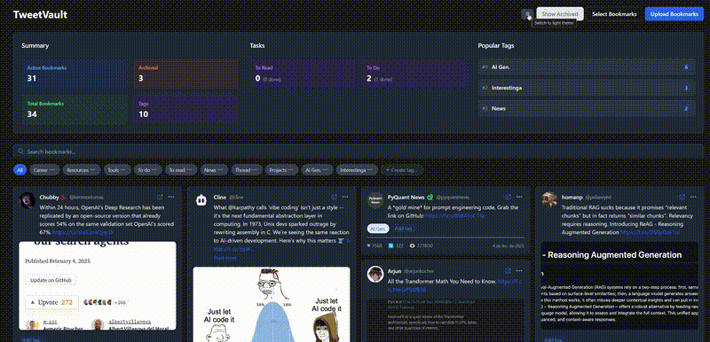

# TweetVault

TweetVault is a full-stack web application designed to help you manage, tag, search, and archive your Twitter bookmarks. With a sleek and responsive interface built using React and Next.js and a powerful backend powered by Go (using Gin and Gorm), TweetVault makes it easy to organize your saved tweets and keep track of your reading or to-do items.

## Demo




---

## Features

- **Bookmark Management:**  
  View detailed bookmarks including full text (with clickable links), images, and media.
  
- **Tagging System:**  
  - Create, rename, and delete custom tags.
  - Includes fixed *standard tags* ("To do", "To read") that cannot be renamed or deleted.
  - Toggle tag completion status on individual bookmarks.

- **Search and Filter:**  
  Quickly search through your bookmarks and filter them by tag.
  
- **Pagination:**  
  Adjustable page size and navigation through bookmark pages.
  
- **Batch Selection:**  
  Easily select multiple bookmarks and perform batch operations (e.g., delete, archive).

- **Statistics Dashboard:**  
  Get a summary of your bookmarks and tag usage including total counts, active and archived bookmarks, and popular tags with completion stats.

- **Upload Handling:**  
  Import Twitter bookmarks by:
  1. Using the [Twitter Web Exporter](https://github.com/prinsss/twitter-web-exporter) browser extension to export your bookmarks
  2. Downloading both the media (.zip file) and data (.json file) from your bookmarks section
  3. Uploading the exported ZIP archive through TweetVault's simple upload interface

---

## Architecture Overview

### Frontend
- **Framework:** Next.js with React and TypeScript  
- **Components:**  
  - **BookmarkCard:** Displays individual bookmark details, with options for tagging, archiving, and deletion.
  - **TagMenu & SearchAndFilter:** Provides an interactive UI for managing and filtering tags.
  - **Pagination & Button:** Custom UI components for navigation and interaction.
  - **Statistics:** A dashboard component to display bookmark and tag statistics.
  
The frontend is organized within the `frontend/src/components` directory where you'll find subdirectories for bookmarks, UI elements, theme management, and more.

### Backend
- **Language & Framework:** Written in Go using the Gin framework and Gorm ORM.
- **Key Modules:**  
  - **Handlers:** Route handlers for bookmarks, tags, uploads, and statistics (located in `backend/internal/api/handlers`).
  - **Services:** Business logic encapsulated in services such as `BookmarkService` (located in `backend/internal/services`).
  - **Database:** Postgres is used as the primary data store. Auto-migrations and initial seed data (e.g., standard tags) are managed on startup.
  
The backend's entry point is located at `backend/cmd/server/main.go`, and routes are defined in `backend/internal/api/routes/routes.go`.

---

## Installation

You can run TweetVault either using Docker Compose (recommended) or by setting up the services locally.

### Method 1: Using Docker (Recommended)

#### Prerequisites
- **Docker** and **Docker Compose** installed on your system
- Git (to clone the repository)

#### Setup Instructions

1. **Clone the repository:**
   ```bash
   git clone https://github.com/helioLJ/TweetVault.git
   cd TweetVault
   ```

2. **Start the application:**
   ```bash
   docker compose up --build
   ```

   This command will:
   - Build all necessary Docker images
   - Start the PostgreSQL database
   - Start the Go backend with hot-reload
   - Start the Next.js frontend with hot-reload
   - Set up all required networking and volumes

3. **Access the application:**
   - Frontend: [http://localhost:3000](http://localhost:3000)
   - Backend API: [http://localhost:8080](http://localhost:8080)
   - Database: localhost:5432

#### Useful Docker Commands

- **Stop the application:**
  ```bash
   docker compose down
  ```

- **View logs:**
  ```bash
  docker compose logs -f
  ```

- **Rebuild and restart a specific service:**
  ```bash
  docker compose up -d --build <service_name>
  # Example: docker compose up -d --build backend
  ```

- **Remove all data (including database):**
  ```bash
  docker compose down -v
  ```

### Method 2: Local Development Setup

#### Prerequisites
- **Node.js** (v14 or higher) & **npm** (or yarn) – for frontend
- **Go** (v1.18 or higher) – for backend
- **PostgreSQL** – Database server

#### Setup Instructions

1. **Clone the repository:**
   ```bash
   git clone https://github.com/helioLJ/TweetVault.git
   cd TweetVault
   ```

2. **Frontend Setup:**
   ```bash
   cd frontend
   npm install
   npm run dev
   ```
   The frontend development server will start on [http://localhost:3000](http://localhost:3000)

3. **Backend Setup:**
   - Set up your database and ensure PostgreSQL is running
   - Configure your environment variables in `.env`:
     ```env
     DB_HOST=localhost
     DB_PORT=5432
     DB_USER=postgres
     DB_PASSWORD=postgres
     DB_NAME=tweetvault
     SERVER_PORT=8080
     ```
   - Install Go dependencies and run the server:
     ```bash
     cd backend
     go mod tidy
     go run cmd/server/main.go # or `air` if you have it installed
     ```
   The backend server will start on [http://localhost:8080](http://localhost:8080)

### Development

Both setup methods support hot-reload for development:
- Frontend changes will automatically refresh in the browser
- Backend changes will automatically rebuild and restart the server (using `air` or Docker)
- Database data persists between restarts

---

## API Endpoints

The backend API is organized under an `/api` route and provides endpoints for core functionalities:

- **Bookmarks:**
  - `GET /api/bookmarks` – List bookmarks with optional filtering by tag or search query.
  - `GET /api/bookmarks/:id` – Retrieve details of a single bookmark.
  - `PUT /api/bookmarks/:id` – Update bookmark details and tags.
  - `DELETE /api/bookmarks/:id` – Delete a bookmark.
  - `POST /api/bookmarks/:id/toggle-archive` – Archive/unarchive a bookmark.

- **Tags:**
  - `GET /api/tags` – Retrieve all tags.
  - `POST /api/tags` – Create a new tag.
  - `PUT /api/tags/:id` – Update a tag.
  - `DELETE /api/tags/:id` – Delete a tag (except standard tags).
  - `GET /api/tags/:id/count` – Get the count of bookmarks using a specific tag.

- **Statistics:**
  - `GET /api/statistics` – Retrieve summary statistics for bookmarks and tags.

- **Uploads:**
  - `POST /api/upload` – Process and import Twitter bookmark data from a ZIP file.

---

## Contributing

We welcome contributions! Please feel free to submit issues and pull requests.

---

## License

This project is licensed under the MIT License. See the [LICENSE](LICENSE) file for details.

